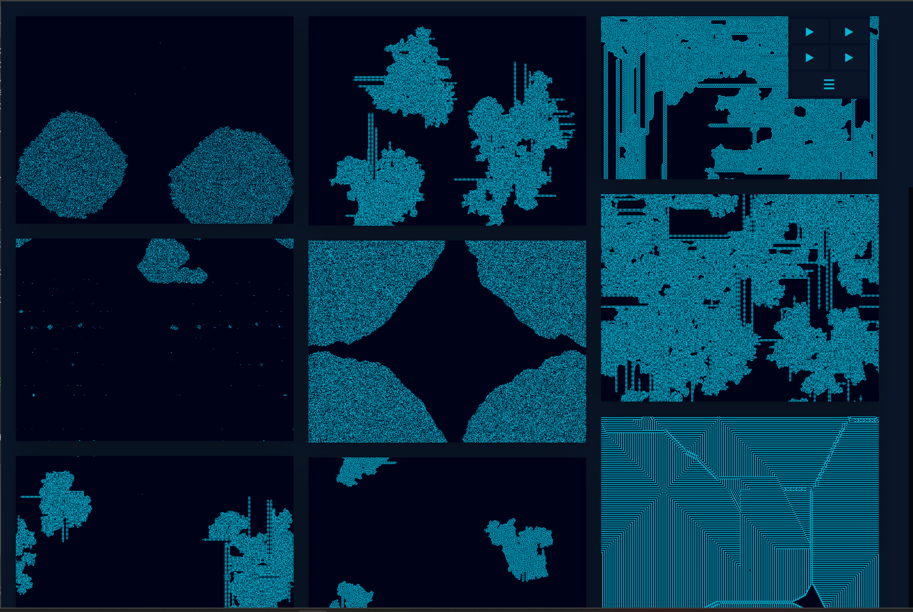

# Moonchild

  

      
       
      <a href="https://jo56.github.io/moonchild" target="_blank">
          <b>https://jo56.github.io/moonchild</b>
      </a>
  

 

Audiovisual project based on images from *Conway's Game of Life*. These were all taken as steps of legitimate large simulations playing out over the grid, with some combined as frames of animation to create GIFs. 
Accompanied with an original guitar soundtrack.

### Controls

Iterate through the galleries using **Left/Right** or **A**/**D**.

Pressing **Shift** toggles menu visibility.

Press **R** to reload images in certain layouts without resetting music status.

Use **1**,**2**,**3**,**4** to toggle the current song. 
